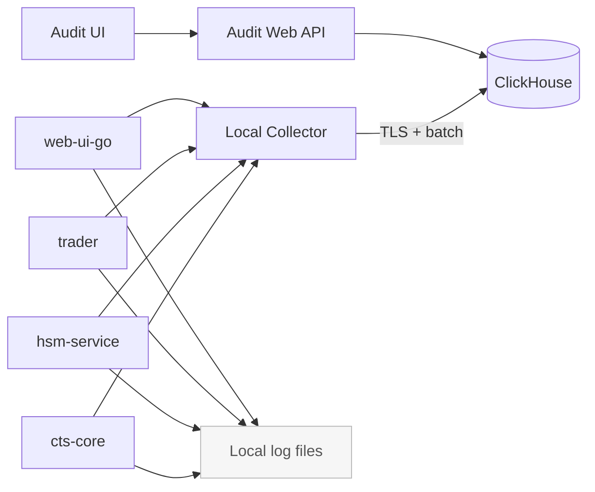
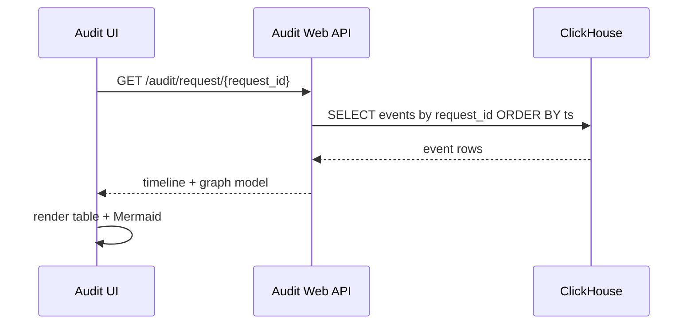
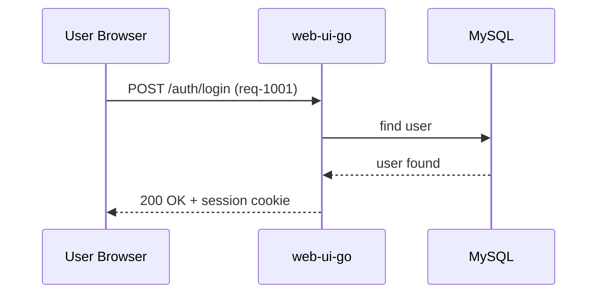
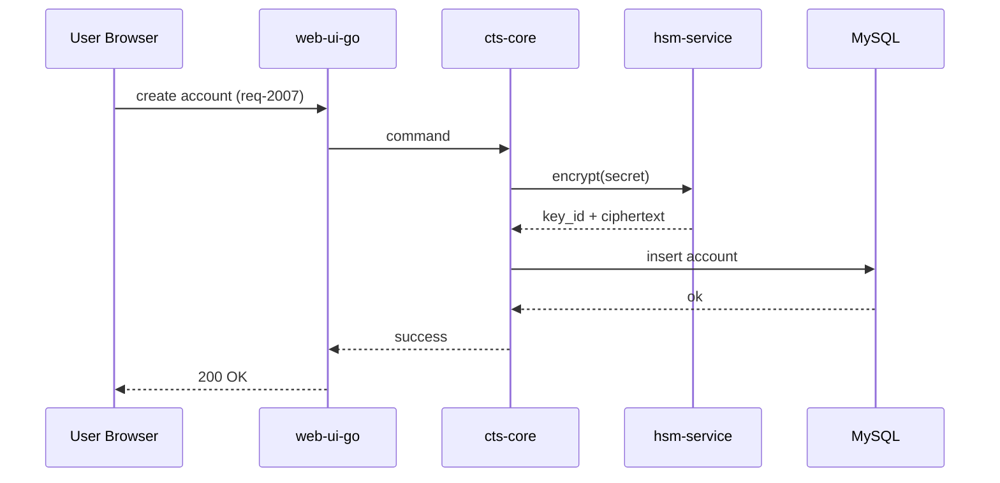
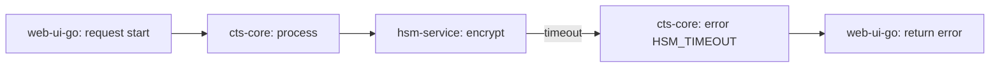

# Unified Audit Web Plan (MVP → Production)

Этот документ — практичный план, как сделать единый аудит всей системы через web-интерфейс:
- видеть события в реальном времени;
- собирать цепочку по `request_id` / `event_id`;
- показывать понятную диаграмму жизненного цикла;
- хранить всё централизованно в ClickHouse;
- не утекать секретами.

---

## 1) Что именно строим

Итоговый результат:
- Один экран «Live Audit»: поток новых событий (похоже на tail, но в браузере).
- Один экран «Request Lifecycle»: вводим `request_id`, получаем:
  - шаги по сервисам,
  - статус каждого шага,
  - Mermaid-диаграмму маршрута.
- Один экран «Event Search»: фильтры по времени, сервису, пользователю, результату (`ok/error`).

Важный принцип:
- Логи в файлы **оставляем** (для локальной диагностики).
- Параллельно отправляем audit-события в централизованное хранилище.

---

## 2) Простая и надёжная архитектура

Лучший практичный вариант:
- Сервисы пишут audit как сейчас (в файл/stdout).
- Локальный агент (например, Vector или OTel Collector) собирает эти события.
- Агент отправляет их в ClickHouse по TLS.
- Web UI читает данные из ClickHouse и строит таймлайн/диаграммы.

Почему так лучше, чем «каждый сервис пишет в ClickHouse напрямую»:
- меньше точек отказа в бизнес-коде;
- меньше сертификатов и проще сопровождение;
- удобнее буферизация и ретраи при сетевых сбоях.

### Diagram 1: Общий поток аудита

---

## 3) Единый формат события (без лишней магии)

Каждое событие должно иметь понятные поля:
- `ts` — время;
- `service` — кто записал;
- `level` — info/warn/error;
- `request_id` — единый ID запроса;
- `event_id` — уникальный ID события;
- `parent_event_id` — связь шагов (если есть);
- `actor_type` / `actor_id` — кто инициатор;
- `action` — что делали (`login`, `encrypt`, `create_order`);
- `target_type` / `target_id` — над чем действие;
- `result` — `ok` / `error`;
- `error_code` / `error_text` — если ошибка;
- `duration_ms` — сколько занял шаг;
- `peer_service` — куда ходили;
- `direction` — `inbound` / `outbound` / `internal`;
- `meta` — безопасные технические детали (без секретов).

### Что **запрещено** писать в audit
- пароли;
- токены;
- API keys;
- приватные ключи;
- полный payload с чувствительными полями.

Вместо этого:
- маскируем (`****`),
- храним хэши/длину/тип, если нужно для диагностики.

---

## 4) Схема таблиц ClickHouse (минимум для старта)

### Таблица `audit_events`
- партиция по дню (`toDate(ts)`),
- сортировка по `(ts, service, request_id, event_id)`,
- TTL (например 90 дней hot + архивный экспорт).

Пример логической структуры:
- ключевые колонки: `ts`, `service`, `request_id`, `event_id`, `action`, `result`, `duration_ms`;
- текстовые детали: `error_text`, `meta_json`;
- служебные: `ingest_ts`, `schema_version`.

### Таблица `audit_requests_mv` (опционально)
Материализованный вид для быстрых экранов:
- старт/финиш запроса,
- итоговый статус,
- список сервисов в цепочке,
- общее время.

---

## 5) TLS и сертификаты (просто и без боли)

Оптимальная схема:
- Не раздавать cert каждому сервису для ClickHouse.
- TLS client cert выдаём **агентам-коллекторам** (1 cert на хост/контейнер-группу).
- Сервисы отправляют события локально агенту (localhost/внутренняя сеть).

Итого:
- меньше сертификатов;
- проще ротация;
- меньше рисков сломать бизнес-сервисы из-за проблем с БД логов.

---

## 6) Web-функции, которые реально нужны

### 6.1 Live Audit
- автоподгрузка каждые 1–2 сек;
- фильтры: сервис, уровень, результат, период;
- быстрый поиск по `request_id`/`event_id`.

### 6.2 Request Lifecycle
- ввод `request_id`;
- таблица шагов (время, сервис, действие, результат, длительность);
- кнопка «Показать диаграмму» (Mermaid).

### 6.3 Event Details
- карточка события: кто, что, где, когда;
- `meta` в читаемом виде;
- явная маскировка чувствительных полей.

### Diagram 2: Как строится цепочка по request_id

---

## 7) Этапы внедрения

## Phase 1 (быстрый MVP, 1-2 недели)
- единый формат audit-события в сервисах;
- локальный collector;
- запись в ClickHouse;
- простой web-экран поиска + детали события.

Результат: уже можно расследовать инциденты централизованно.

## Phase 2 (цепочки и визуализация)
- endpoint «lifecycle by request_id»;
- Mermaid-диаграмма маршрута;
- live view.

Результат: видно полный путь запроса по системам.

## Phase 3 (надежность и масштаб)
- буферы/ретраи/алерты по задержке доставки;
- TTL/архив;
- RBAC и аудит доступа к аудиту;
- предсобранные агрегаты для быстрых дашбордов.

Результат: production-grade аудит на большой нагрузке.

---

## 8) Правила качества и безопасности

- Единый `request_id` обязателен на входе и между сервисами.
- Если входящий `request_id` пустой — генерируем и прокидываем дальше.
- Все межсервисные вызовы обязаны передавать correlation headers.
- Логи аудита неизменяемые (append-only).
- Доступ к экрану аудита только для ограниченных ролей.

---

## 9) 3 живых примера прохождения

## Пример A: Успешный вход пользователя

Дано:
- `request_id = req-1001`
- пользователь `user:42`

Путь:
1. `web-ui-go` принимает login (`inbound`).
2. `web-ui-go` валидирует пользователя в БД (`internal`).
3. `web-ui-go` создаёт сессию (`internal`).
4. Ответ `200 OK`.

Что увидим в аудит-цепочке:
- `auth.login.start` → `auth.user.lookup.ok` → `auth.session.created` → `auth.login.success`.

## Пример B: Шифрование ключа через HSM

Дано:
- `request_id = req-2007`
- операция `create_exchange_account`

Путь:
1. `web-ui-go` принимает запрос.
2. `cts-core` получает команду на сохранение аккаунта.
3. `cts-core` вызывает `hsm-service` (`outbound`).
4. `hsm-service` шифрует и возвращает `key_id`.
5. `cts-core` пишет запись в БД.
6. Возврат успеха в UI.

Что увидим:
- где была задержка (обычно HSM или DB);
- какие сервисы участвовали;
- итог `ok`.

## Пример C: Ошибка в середине цепочки

Дано:
- `request_id = req-3055`
- `hsm-service` временно недоступен

Путь:
1. `web-ui-go` и `cts-core` начинают обработку.
2. Вызов в `hsm-service` падает по timeout.
3. `cts-core` фиксирует `error_code=HSM_TIMEOUT`.
4. UI получает понятную ошибку.

Что важно в аудит-экране:
- сразу виден сломанный шаг;
- видно, что до БД запись не дошла;
- есть полный контекст без секретов.

---

## 10) Что можно сделать лучше позже (не в MVP)

- OpenTelemetry traces + привязка к audit events;
- anomaly detection (всплески ошибок, необычные цепочки);
- готовые расследования «в 1 клик» (runbooks);
- экспорт расследования в PDF/JSON.

---

## 11) Короткий итог

Идея правильная и практически полезная.
Лучший путь: централизованный audit через collector + ClickHouse + web lifecycle viewer.
Так мы получим:
- прозрачность всей цепочки запроса,
- быстрые расследования,
- контроль безопасности,
- и при этом не перегрузим бизнес-сервисы сложной инфраструктурой.
