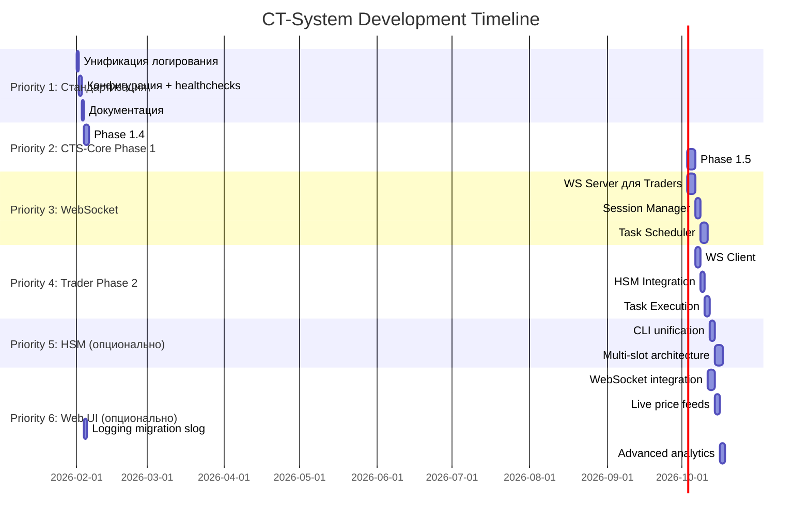

# CT-System — Общий план разработки

> **Версия**: 1.0  
> **Дата**: 2026-02-01  
> **Статус**: Docker окружение готово | Фокус на стандартизации

---

## 📊 Текущее состояние системы

### ✅ Что работает

| Компонент | Статус | Версия | Healthcheck |
|-----------|--------|--------|-------------|
| **MySQL** | ✅ Running | 9.0 | ✅ Healthy |
| **HSM Service** | ✅ Running | Production-ready | ✅ Healthy |
| **CTS-Core** | ✅ Running | Phase 1.3 Complete | ✅ Healthy |
| **Web UI** | ✅ Running | Operational | ✅ Healthy |
| **Trader-1** | ✅ Running | Phase 1 Complete | ✅ Healthy |
| **Docker Compose** | ✅ Ready | All services orchestrated | ✅ All healthy |

### 📍 Прогресс по фазам

**CTS-Core:**
- ✅ Phase 0: Database schema (18 таблиц)
- ✅ Phase 1.1: Project setup + config + logger
- ✅ Phase 1.2: MySQL pool + repositories (8 repos)
- ✅ Phase 1.3: HSM client (dual context: trading + 2FA)
- 🔴 **Phase 1.4**: State management (в процессе)
- ⏳ Phase 1.5: Basic REST API
- ⏳ Phase 2: WebSocket + Session manager
- ⏳ Phase 3: Task scheduler + Load balancing
- ⏳ Phase 4: Full integration + Trade results

**Trader Daemon:**
- ✅ Phase 1: Фундамент (структура, типы, базовая инфраструктура)
- ⏳ Phase 2: WebSocket client к CTS-Core
- ⏳ Phase 3: Order book + Pub/Sub
- ⏳ Phase 4+: Task management, Monitor/Trader roles

**HSM Service:**
- ✅ Production-ready (mTLS, key rotation, ACL, monitoring)
- 🟡 Предложения: объединение CLI, multi-slot architecture

**Web UI (Go):**
- ✅ Operational (authentication, user/group management, exchanges)
- ✅ Phase 4.1: Position analytics API (P&L calculations, user analytics)
- ⏳ Phase 4.2+: Real-time updates, WebSocket integration, live price feeds
- 🟡 Миграция на slog (опционально, сейчас использует zerolog)

---

## 🎯 ПРИОРИТЕТЫ РАЗРАБОТКИ

### Priority 1: Стандартизация (2-3 дня) 🔴

**Проблема:** Разные подходы к критически важным аспектам системы создают технический долг и усложняют поддержку.

#### 1.1. Унификация логирования (1 день)

**Текущая ситуация:**

| Сервис | Библиотека | Формат | Stdout | Файл | Docker compatibility |
|--------|-----------|--------|--------|------|---------------------|
| HSM | `log/slog` | JSON | ✅ | ✅ | ✅ Отлично |
| CTS-Core | `log/slog` | Plain text | ❌ | ✅ | ❌ Плохо |
| Trader | `log/slog` | Plain text | ❌ | ✅ | ❌ Плохо |
| Web UI | `zerolog` | Text | ✅ | ✅ | ✅ Хорошо |

**Проблемы:**
- CTS-Core и Trader логи **не видны** в `docker logs`
- Разные форматы усложняют централизованный сбор логов
- Plain text сложнее парсить автоматически
- Web UI использует внешнюю зависимость (zerolog)

**Решение:**
- ✅ **Эталон**: HSM Service (slog + JSON + stdout + file + lumberjack)
- 🔧 **Исправить**: CTS-Core, Trader (добавить MultiWriter с stdout)
- 🔧 **Опционально**: Web UI перевести на slog (убрать зависимость от zerolog)
  - **Текущее состояние Web UI**: zerolog с text format + stdout + file
  - **Конфигурация**: YAML (logging.output: "both")
  - **Работает корректно**: ✅ логи видны в docker logs
  - **Причина миграции**: единообразие с остальными сервисами, JSON формат
  - **Приоритет**: LOW (работает, но желательно унифицировать)

**Задачи:**
```
[ ] CTS-Core: Добавить os.Stdout в MultiWriter
[ ] CTS-Core: Переключить на JSON формат (slog.NewJSONHandler)
[ ] CTS-Core: Использовать lumberjack вместо кастомного rotatedFile
[ ] Trader: Аналогично CTS-Core (stdout + JSON + lumberjack)
[ ] Web UI: Оценить целесообразность миграции на slog
[ ] Тестирование: Проверить docker logs для всех сервисов
[ ] Документация: Обновить FIX_LOGGING_QUICK.md
```

**Результат:**
- Все логи видны в `docker logs <service>`
- Единый JSON формат для ELK/Loki/Grafana
- Файлы с ротацией для долгосрочного хранения
- Нет внешних зависимостей (только stdlib + lumberjack)

**Файлы:**
- `/home/dev/docker/ct-system/LOGGING_ANALYSIS.md` (подробный анализ)
- `services/cts-core/internal/logger/logger.go`
- `services/trader-daemon/internal/logger/logger.go`
- `services/web-ui-go/internal/logger/logger.go`

---

#### 1.2. Унификация конфигурации (0.5 дня)

**Текущая ситуация:**

| Сервис | Формат | Env override | Validation |
|--------|--------|--------------|------------|
| HSM | YAML | ✅ | ✅ |
| CTS-Core | YAML | ✅ | ✅ |
| Trader | INI | ❌ | ⚠️ |
| Web UI | YAML | ✅ | ✅ |

**Проблема:**
- Trader использует INI (отличается от остальных)
- Inconsistent ENV variable support

**Решение:**
- Trader: мигрировать на YAML (как CTS-Core и HSM)
- Стандартизировать ENV override pattern

**Задачи:**
```
[ ] Trader: config.ini → config.yaml
[ ] Trader: Добавить поддержку ENV variables (${VAR:-default})
[ ] Проверить: все сервисы читают ENV из docker-compose.yml
[ ] Документация: Обновить README.md с примерами конфигов
```

---

#### 1.3. Стандартизация healthchecks (0.5 дня)

**Текущая ситуация:**
- ✅ HSM: `/health` endpoint (HTTPS)
- ✅ MySQL: `mysqladmin ping`
- ⚠️ CTS-Core: healthcheck есть, но deadlock при старте
- ⚠️ Trader: healthcheck отсутствует
- ✅ Web UI: HTTP endpoint

**Решение:**
- Все HTTP сервисы: `/health` endpoint (GET)
- Стандартный формат ответа:
  ```json
  {
    "status": "healthy",
    "service": "cts-core",
    "version": "1.4.0",
    "uptime": "2h34m12s",
    "dependencies": {
      "mysql": "connected",
      "hsm": "connected"
    }
  }
  ```

**Задачи:**
```
[ ] CTS-Core: Исправить deadlock при старте (см. Phase 1.4)
[ ] CTS-Core: Улучшить /health (добавить dependencies check)
[ ] Trader: Добавить /health endpoint на отдельном порту
[ ] Docker-compose: Обновить healthcheck для всех сервисов
[ ] Тестирование: make health-check (проверка всех сервисов)
```

---

#### 1.4. Документация и CI/CD подготовка (1 день)

**Задачи:**
```
[ ] README.md: Обновить с учетом стандартизации
[ ] ARCHITECTURE.md: Добавить диаграммы взаимодействия сервисов
[ ] API_SPECIFICATION.md: Унифицировать форматы всех API
[ ] .github/workflows/: Подготовить CI pipeline (lint, test, build)
[ ] Makefile: Добавить targets для стандартизации (make lint-all, make test-all)
```

---

### Priority 2: Завершение Phase 1 CTS-Core (5-7 дней) 🟡

#### 2.1. Phase 1.4: State Management (2 дня)

**Текущая проблема:**
- Deadlock при старте CTS-Core (select без cases)
- State persistence не реализован

**Задачи:**
```
[ ] Реализовать StateManager (load/save daemon.state)
[ ] Исправить deadlock в main.go
[ ] Добавить graceful shutdown (SIGTERM, SIGINT)
[ ] State format: JSON с версионированием
[ ] Atomic writes (write → rename)
[ ] Tests: state save/load/recovery
[ ] Документация: guides/phase_1_4_state_management.md
```

**Файлы:**
- `services/cts-core/internal/state/state.go`
- `services/cts-core/cmd/cts-core/main.go`

---

#### 2.2. Phase 1.5: Basic REST API (3 дня)

**Scope:**
- GET `/health` - healthcheck
- GET `/api/v1/traders` - список подключенных трейдеров
- GET `/api/v1/traders/{id}` - информация о трейдере
- GET `/api/v1/stats` - общая статистика
- GET `/api/v1/tasks` - текущие задачи

**Задачи:**
```
[ ] Создать internal/api/server.go (HTTP server setup)
[ ] Создать internal/api/rest/ handlers
[ ] Middleware: logging, recovery, CORS
[ ] Tests: unit + integration (httptest)
[ ] OpenAPI spec (Swagger)
[ ] Rate limiting (базовый)
[ ] Документация: API_SPECIFICATION.md
```

**Зависимости:**
- State Manager (Phase 1.4)
- MySQL repositories (Phase 1.2) ✅

---

### Priority 3: WebSocket Infrastructure (7-10 дней) 🟢

#### 3.1. Phase 2.1: WebSocket Server для Traders (3 дня)

**Протокол:**
```json
// Trader → CTS-Core
{
  "type": "register",
  "trader_id": "trader-1",
  "exchange": "binance",
  "capabilities": ["spot", "futures"],
  "version": "1.0.0"
}

// CTS-Core → Trader
{
  "type": "task",
  "task_id": "task-123",
  "task_type": "arbitrage_cross",
  "params": {...}
}
```

**Задачи:**
```
[ ] internal/api/ws/trader_handler.go
[ ] Connection pooling + heartbeat (30s)
[ ] Message routing (task assignment)
[ ] Reconnection handling
[ ] Tests: WS integration tests
```

---

#### 3.2. Phase 2.2: Session Manager (2 дня)

**Функции:**
- Registration: Trader подключается
- Hybrid registration: MySQL (persistent) + memory (active)
- Heartbeat tracking (disconnect after 3 missed)
- Resource limits (max connections)

**Задачи:**
```
[ ] internal/session/manager.go
[ ] internal/session/trader.go
[ ] internal/session/heartbeat.go
[ ] DB integration (trader_session table)
[ ] Metrics: active_traders, heartbeat_latency
[ ] Tests: session lifecycle
```

---

#### 3.3. Phase 2.3: Task Scheduler (3 дня)

**Алгоритм:**
- Scoring: latency (50%) + workload (30%) + history (20%)
- Load balancing между traders
- Task retry на failure
- Priority queue

**Задачи:**
```
[ ] internal/scheduler/scheduler.go
[ ] internal/scheduler/assignment.go (scoring)
[ ] internal/scheduler/latency.go
[ ] DB integration (scheduler_task table)
[ ] Tests: load balancing, retries
```

---

### Priority 4: Trader Daemon Phase 2 (5-7 дней) 🟢

#### 4.1. WebSocket Client к CTS-Core (2 дня)

**Задачи:**
```
[ ] internal/core/ws/client.go (WS client)
[ ] Reconnection с exponential backoff
[ ] Message handlers (register, task, heartbeat)
[ ] Integration с существующей структурой
[ ] Tests: WS client lifecycle
```

---

#### 4.2. HSM Integration в Trader (2 дня)

**Задачи:**
```
[ ] Интеграция HSM client (аналогично CTS-Core Phase 1.3)
[ ] Credential decryption flow
[ ] Secure storage encrypted credentials
[ ] Tests: HSM integration
```

---

#### 4.3. Task Execution Framework (2 дня)

**Задачи:**
```
[ ] internal/task/executor.go
[ ] Task types: arbitrage_cross, triangular, limit_market
[ ] Result reporting к CTS-Core
[ ] Error handling + retries
[ ] Tests: task execution
```

---

### Priority 5: HSM Service Enhancements (3-5 дней) ⚪

**Опционально (low priority):**

```
[ ] Объединение create-kek в hsm-admin (CLI unification)
[ ] Multi-slot architecture (изоляция контекстов)
[ ] Audit API (REST endpoint для аудита)
[ ] Key escrow (split knowledge для recovery)
[ ] Encrypted backup automation
```

**Статус:** HSM уже production-ready, улучшения можно отложить

---

### Priority 6: Web UI Enhancements (5-7 дней) ⚪

**Опционально (после CTS-Core Phase 2 WebSocket):**

#### 6.1. WebSocket Integration (3 дня)

**Цель:** Real-time обновления данных в UI без перезагрузки страницы

**Задачи:**
```
[ ] WebSocket client в frontend (JavaScript)
[ ] Подключение к CTS-Core WS endpoint (Phase 2)
[ ] Real-time trader status updates
[ ] Real-time task assignment notifications
[ ] Live position P&L updates
[ ] System health monitoring dashboard
[ ] Tests: WS connection, reconnection, message handling
```

**Зависимости:**
- CTS-Core Phase 2 WebSocket server (admin endpoint) ✅ После Priority 3

---

#### 6.2. Live Price Feeds (2 дня)

**Цель:** Автоматическое обновление цен без ручного ввода

**Текущее состояние:**
- Phase 4.1: Manual price updates (`POST /positions_calc/ajax_update_price`)
- Phase 4.1: P&L calculations с текущими ценами

**Задачи:**
```
[ ] Integration с exchange APIs (Binance, KuCoin, Bybit)
[ ] Price caching (Redis опционально)
[ ] Auto-update prices every 5-10 seconds
[ ] Fallback на ручной ввод при API failures
[ ] Price history storage (для графиков)
[ ] Tests: API integration, price updates, error handling
```

**API Sources:**
- Binance: `wss://stream.binance.com:9443/ws`
- KuCoin: `wss://ws-api.kucoin.com/endpoint`
- Bybit: `wss://stream.bybit.com/v5/public/spot`

---

#### 6.3. Logging Migration на slog (1 день)

**Цель:** Единый подход к логированию во всей системе

**Текущее состояние:**
- Web UI использует `zerolog` (text format)
- Конфигурация: `logging.output: "both"` (stdout + file)
- ✅ Работает корректно, логи видны в docker logs

**Задачи:**
```
[ ] Заменить zerolog на log/slog
[ ] Переключить на JSON формат (slog.NewJSONHandler)
[ ] Использовать lumberjack для ротации (как в HSM)
[ ] Обновить internal/logger/logger.go
[ ] Обновить конфигурацию (logging.format: "json")
[ ] Удалить зависимость: github.com/rs/zerolog
[ ] Tests: logging initialization, format, rotation
[ ] Документация: обновить LOGGING.md
```

**Приоритет:** LOW (работает, но для единообразия желательно)

---

#### 6.4. Advanced Analytics Dashboard (2 дня)

**Текущее состояние:** Phase 4.1 API готов

**Задачи:**
```
[ ] Interactive charts (Chart.js или Plotly)
[ ] Portfolio performance timeline
[ ] P&L history graphs
[ ] Win/loss distribution
[ ] Symbol-based analytics
[ ] Export reports (CSV, PDF)
[ ] Tests: chart rendering, data accuracy
```

---

## 📅 Timeline (оценка)



**Итого:**
- **Week 1-2**: Стандартизация + CTS-Core Phase 1 complete
- **Week 3-4**: WebSocket infrastructure (CTS-Core + Trader)
- **Week 5+**: Business logic, testing, production hardening
- **Week 6+** (опционально): Web UI enhancements (live updates, price feeds)

---

## 🎯 Success Criteria

### Week 1 (Стандартизация)
- [ ] Все сервисы: логи видны в `docker logs`
- [ ] Единый формат: JSON (slog)
- [ ] Единая конфигурация: YAML + ENV
- [ ] Все healthchecks работают
- [ ] Документация обновлена

### Week 2 (CTS-Core Phase 1 Complete)
- [ ] State management работает (load/save/recovery)
- [ ] REST API доступен (5 endpoints)
- [ ] Все тесты проходят (unit + integration)
- [ ] OpenAPI спецификация готова

### Week 3-4 (WebSocket Infrastructure)
- [ ] Trader может подключиться к CTS-Core через WS
- [ ] Регистрация + heartbeat работает
- [ ] Task assignment работает (1 trader)
- [ ] Load balancing работает (3 traders)

### Week 5+ (Production Ready)
- [ ] Все 3 Trader-а выполняют задачи
- [ ] Trade results processing работает
- [ ] Metrics в Prometheus
- [ ] Stress tests: 1000+ tasks/sec

---

## 📂 Структура документации

```
/home/dev/docker/ct-system/
├── DEVELOPMENT_PLAN.md          # ← Этот файл (общий план)
├── ARCHITECTURE.md              # Общая архитектура системы
├── LOGGING_ANALYSIS.md          # Анализ логирования (можно удалить после P1)
├── HSM_ROTATION.md              # HSM key rotation (готово)
├── README.md                    # Quick start
├── docker-compose.yml           # Оркестрация
│
└── services/
    ├── cts-core/
    │   ├── DEVELOPMENT_PLAN.md  # CTS-Core детальный план
    │   ├── ARCHITECTURE.md      # CTS-Core архитектура
    │   ├── API_SPECIFICATION.md # CTS-Core API
    │   └── guides/              # Phase-by-phase guides
    │
    ├── trader-daemon/
    │   ├── DEVELOPMENT_PLAN.md  # Trader детальный план
    │   └── ...
    │
    ├── hsm-service/
    │   ├── DEVELOPMENT_PLAN.md  # HSM improvements
    │   └── ...
    │
    └── web-ui-go/
        ├── internal/
        │   ├── controllers/
        │   │   ├── PHASE4_API.md      # Phase 4.1 Analytics API
        │   │   ├── USER_CONTROLLER.md
        │   │   └── GROUP_CONTROLLER.md
        │   └── logger/
        │       └── LOGGING.md         # Web UI logging (zerolog)
        └── config/
            └── config.yaml            # Web UI configuration
```

---

## 🔄 Workflow

### Daily Development

```bash
# 1. Проверить статус всех сервисов
make ps

# 2. Посмотреть логи (теперь работает для всех!)
docker logs ct-system-cts-core -f
docker logs ct-system-trader-1 -f

# 3. Запустить тесты
cd services/cts-core
make test

# 4. Пересобрать после изменений
make rebuild
make up
```

### Code Review Checklist

```
[ ] Logging: используется slog + JSON + stdout
[ ] Config: YAML с ENV override
[ ] Tests: unit + integration
[ ] Errors: wrapped с context
[ ] Healthcheck: работает
[ ] Docker logs: логи видны
[ ] Documentation: обновлена
```

---

## 📌 Важные заметки

1. **Не коммитить в git:**
   - `volumes/` (данные Docker)
   - `.env` (секреты)
   - `logs/` (логи)
   - `state/` (состояние демонов)

2. **Git структура:**
   - Корень: оркестрация (docker-compose, Makefile)
   - `services/*`: каждый имеет свой `.git/`

3. **HSM Key Rotation:**
   - Автопроверка: `./check-hsm-rotation-simple.sh`
   - Cron setup: см. `HSM_ROTATION.md`
   - 67 дней до следующей ротации ✅

4. **Приоритеты:**
   - 🔴 **P1**: Стандартизация (блокер для всего остального)
   - 🟡 **P2**: CTS-Core Phase 1 complete
   - 🟢 **P3-4**: WebSocket + Traders
   - ⚪ **P5**: HSM improvements (можно отложить)
   - ⚪ **P6**: Web UI enhancements (после WebSocket infrastructure)

---

## 🚀 Next Steps

**Сегодня (2026-02-01):**
1. ✅ Удалить MIGRATE_SYS_TO_DOCKER.md (выполнено)
2. ✅ Создать DEVELOPMENT_PLAN.md (этот файл)
3. 🔴 **Начать Priority 1.1**: Унификация логирования
   - Исправить CTS-Core logger (добавить stdout)
   - Исправить Trader logger (добавить stdout)
   - Протестировать `docker logs` для всех сервисов

**Завтра:**
- Продолжить Priority 1: конфигурация + healthchecks
- Начать Priority 2: Phase 1.4 State Management

**Вопросы для обсуждения:**
- Web UI: мигрировать на slog или оставить zerolog?
- Trader config: INI → YAML приоритет?
- CI/CD: какой pipeline предпочтительнее? (GitHub Actions, GitLab CI, Jenkins)

---

*Документ обновляется по мере прогресса. При возврате к проекту - начать с секции "Next Steps".*
