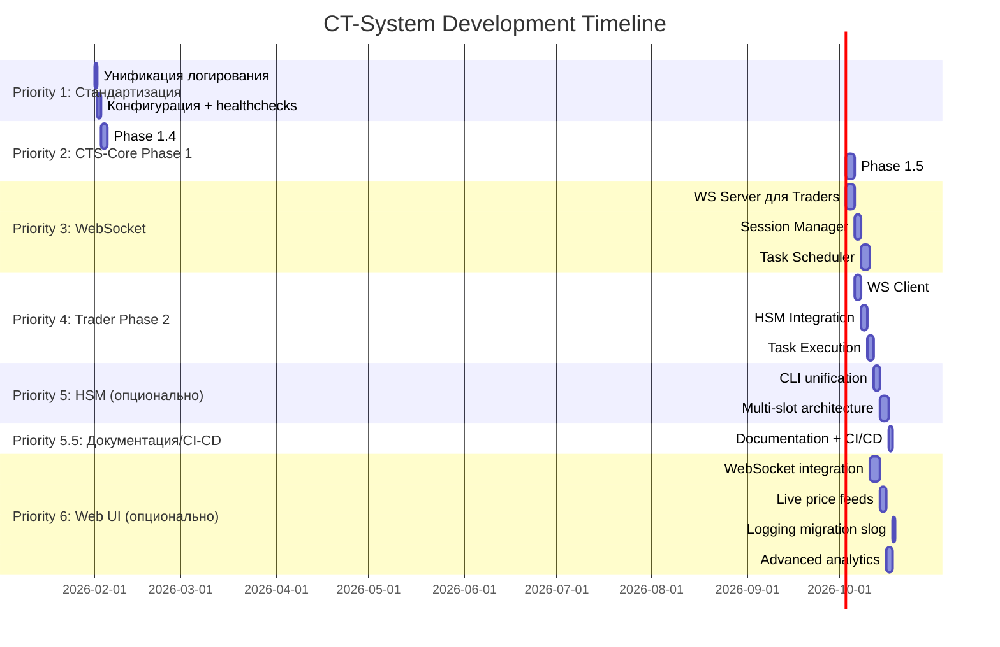

# CT-System — Общий план разработки

> **Версия**: 1.1  
> **Дата**: 2026-03-14  
> **Статус**: Docker окружение стабильно | CTS-Core Phase 2 завершена | CTS-Core Phase 1.5 завершена | Фокус на Phase 3

---

## 📊 Текущее состояние системы

### ✅ Что работает

| Компонент | Статус | Версия | Healthcheck |
|-----------|--------|--------|-------------|
| **MySQL** | ✅ Running | 9.0 | ✅ Healthy |
| **HSM Service** | ✅ Running | Production-ready | ✅ Healthy |
| **CTS-Core** | ✅ Running | Phase 2 Complete | ✅ Healthy |
| **Web UI** | ✅ Running | Operational | ✅ Healthy |
| **Trader-1** | ✅ Running | Phase 1 Complete | ✅ Healthy |
| **Docker Compose** | ✅ Ready | All services orchestrated | ✅ All healthy |

### 📍 Прогресс по фазам

**CTS-Core:**
- ✅ Phase 0: Database schema (18 таблиц)
- ✅ Phase 1.1: Project setup + config + logger
- ✅ Phase 1.2: MySQL pool + repositories (8 repos)
- ✅ Phase 1.3: HSM client (dual context: trading + 2FA)
- ✅ Phase 1.4: State management
- ✅ Phase 1.5: Finalization (`/metrics`, Prometheus wiring, integration tests)
- ✅ Phase 2: WebSocket runtime + session lifecycle + scheduler skeleton + smoke/runbook
- ⏳ Phase 3: Task scheduler business logic + load balancing
- ⏳ Phase 4: Full integration + Trade results

**Trader:**
- ✅ Phase 1: Фундамент (структура, типы, базовая инфраструктура)
- ⏳ Phase 2: WebSocket client к CTS-Core
- ⏳ Phase 3: Order book + Pub/Sub
- ⏳ Phase 4+: Task management, Monitor/Trader roles

**HSM Service:**
- ✅ Production-ready (mTLS, key rotation, ACL, monitoring)
- 🟡 Предложения: multi-slot architecture

**Web UI (Go):**
- ✅ Recovered core: authentication, users/groups, exchanges, exchange accounts
- 🔴 Missing in recovered code: positions, market analysis, daemon, coins
- ⏳ Phase 4.1 analytics: not implemented in recovered code
- ✅ Логирование унифицировано: `slog` + `access.log/error.log` + fail-fast + graceful shutdown

---

## 🎯 ПРИОРИТЕТЫ РАЗРАБОТКИ

### Priority 1: Стандартизация 🔴

**Проблема:** Разные подходы к критически важным аспектам системы создают технический долг и усложняют поддержку.

#### 1.1. Унификация логирования ✅ DONE

**Статус:** унификация завершена во всех сервисах.

**Текущая ситуация:**

| Сервис | Библиотека | Формат | Stdout | Файл | Ротация | docker logs |
|--------|-----------|--------|--------|------|---------|------------|
| HSM | ✅ slog | ✅ JSON | ✅ | ✅ | ✅ lumberjack | ✅ Работает |
| CTS-Core | ✅ slog | ✅ JSON | ✅ | ✅ | ✅ lumberjack | ✅ Работает |
| Trader | ✅ slog | ✅ JSON | ✅ | ✅ | ✅ lumberjack | ✅ Работает |
| Web UI | ✅ slog | ✅ JSON | ✅ | ✅ | ✅ lumberjack | ✅ Работает |

**Результат:**
- Все логи видны в `docker logs <service>`
- Единый JSON формат для ELK/Loki/Grafana
- Файлы с ротацией для долгосрочного хранения
- Нет внешних зависимостей (только stdlib + lumberjack)
- Web UI: разделенные логи (access.log + error.log) для аналитики и отладки

**Файлы:**
- `/home/dev/docker/cts-system/LOGGING.md` (единый документ по логированию)
- `services/cts-core/internal/logger/logger.go`
- `services/trader/internal/logger/logger.go`
- `services/web-ui-go/internal/logger/logger.go` (с access/error разделением)
- `services/web-ui-go/internal/middleware/request_logging.go` (новый файл для HTTP логирования)

---

#### 1.2. Унификация конфигурации ✅ DONE

**Текущая ситуация:**

| Сервис | Формат конфига | Env override | Validation | Примечание |
|--------|----------------|--------------|------------|------------|
| HSM | YAML (`config.yaml`) | ✅ (`HSM_*`) | ✅ | logging и runtime-параметры синхронизированы |
| CTS-Core | YAML (`conf/config.yaml`) | ✅ (`CTS_*`) | ✅ | единая схема логов/путей и `metrics` секция в конфиге |
| Trader | YAML (`conf/config.yaml`) | ✅ (`TRADER_*`) | ✅ | унифицированы stream paths + `*_to_stdout` флаги |
| Web UI | YAML (`config/*.yaml`) | ✅ (`CT_*`) | ✅ | proxy/direct профили синхронизированы, logging-флаги добавлены |

**Что зафиксировано как итог унификации:**
- Все сервисы используют YAML как основной формат runtime-конфигурации.
- Для каждого сервиса закреплён единый префикс ENV override.
- Конфигурационные примеры (`config.example`/profile configs) синхронизированы с runtime-схемой.
- Документация по конфигам обновлена в root и service-level планах/README.

---

#### 1.3. Стандартизация healthchecks

**Решение (зафиксировано):**
- **DEV (Docker Compose):** использовать process-level healthcheck (`pgrep`/аналог), без обязательной стандартизации HTTP `/health`.
- **PROD (боевые серверы, без Docker):**
  - **Trader:** не имеет входящего health endpoint; статус определяется в `CTS-Core` по `WS ping/pong` и heartbeat.
  - **Trader (локально):** контроль зависаний и авто-восстановление через `systemd watchdog` + `Restart=always`.
  - **HSM:** без изменений (оставляем текущий `/health` по mTLS).
  - **CTS-Core:** отдельный health endpoint по mTLS; агрегирует статус `HSM` и `Trader`.
   - **Web UI:** открытый `/health` только с минимальным ответом `true/false`.
- **Ограничение на раскрытие информации:** для monitoring endpoint'ов не выдаём детали зависимостей, stack/error текст, версии и внутренние поля состояния в публичном ответе.

**Задачи:**
```
[x] Docker Compose: унифицировать healthcheck на process-level (`pgrep`/аналог) для dev-профиля
[ ] Trader: закрепить health-модель без входящего endpoint (источник статуса = WS ping/pong в CTS-Core, реализация в Priority 3: Phase 2.1/2.2)
[ ] Trader: оформить systemd watchdog/runbook для production (без Docker) — перенести на этап подготовки Debian PROD инструкции
[ ] CTS-Core: реализовать mTLS health endpoint с агрегированным статусом HSM/Trader (Trader часть после WS heartbeat в Priority 3)
[x] Web UI: зафиксировать открытый `/health` с ответом только true/false
[ ] Документация: синхронизировать README/ops runbook по dev/prod политике healthchecks — перенести на этап Debian PROD инструкции (после WS health-агрегации)
```

---

#### 1.4. Документация и CI/CD подготовка (1 день) ⏸️

**Статус:** отложено; переносим после `Priority 5`.

---

### Priority 2: CTS-Core Phase 1.5 Finalization (завершено) ✅

#### 2.1. Phase 1.4: State Management (завершено)

**Статус:** завершено, state persistence работает в runtime.

**Задачи:**
```
[x] Реализовать StateManager (load/save daemon.state)
[x] Исправить startup deadlock issues
[x] Добавить graceful shutdown (SIGTERM, SIGINT)
[x] State format: JSON с версионированием
[x] Atomic writes (write → rename)
[x] Базовые тесты state save/load
```

**Файлы:**
- `services/cts-core/internal/state/state.go`
- `services/cts-core/cmd/cts-core/main.go`

---

#### 2.2. Phase 1.5: Finalization (3 дня)

**Scope:**
- Финализировать `/metrics`
- Синхронизировать runtime метрики и Prometheus wiring
- Закрыть integration тесты для health/ws smoke-path

**Задачи:**
```
[x] REST health endpoints (`/health`, `/ready`, `/live`)
[x] WS runtime baseline (`trader.register`, `trader.heartbeat`)
[x] Session lifecycle persistence (`TRADER_SESSION`)
[x] Scheduler runtime skeleton
[x] `/metrics` endpoint и exporter wiring
[x] Integration tests (compose health + ws lifecycle)
```

Примечание:
Исторические секции ниже (Phase 2.1/2.2/2.3 как planned) оставлены как архивная детализация. Актуальный факт: базовый объем Phase 2 для CTS-Core закрыт.

**Зависимости:**
- State Manager (Phase 1.4)
- MySQL repositories (Phase 1.2) ✅

---

### Priority 3: WebSocket Infrastructure (7-10 дней) 🟢

#### 3.1. Phase 2.1: WebSocket Server для Traders (3 дня)

**Протокол:**
```json
// Trader → CTS-Core
{
  "type": "register",
  "trader_id": "trader-1",
  "exchange": "binance",
  "capabilities": ["spot", "futures"],
  "version": "1.0.0"
}

// CTS-Core → Trader
{
  "type": "task",
  "task_id": "task-123",
  "task_type": "arbitrage_cross",
  "params": {...}
}
```

**Задачи:**
```
[ ] internal/api/ws/trader_handler.go
[ ] Connection pooling + heartbeat (30s)
[ ] WS ping/pong: передавать heartbeat в Session Manager для health-агрегации
[ ] Message routing (task assignment)
[ ] Reconnection handling
[ ] Tests: WS integration tests
```

---

#### 3.2. Phase 2.2: Session Manager (2 дня)

**Функции:**
- Registration: Trader подключается
- Hybrid registration: MySQL (persistent) + memory (active)
- Heartbeat tracking (disconnect after 3 missed)
- Resource limits (max connections)

**Задачи:**
```
[ ] internal/session/manager.go
[ ] internal/session/trader.go
[ ] internal/session/heartbeat.go
[ ] Агрегировать состояние Trader по ping/pong (online/stale/offline + last_seen)
[ ] Экспортировать агрегированный статус Trader в `CTS-Core` endpoint `/health`
[ ] DB integration (trader_session table)
[ ] Metrics: active_traders, heartbeat_latency
[ ] Tests: session lifecycle
```

---

#### 3.3. Phase 2.3: Task Scheduler (3 дня)

**Алгоритм:**
- Scoring: latency (50%) + workload (30%) + history (20%)
- Load balancing между traders
- Task retry на failure
- Priority queue

**Задачи:**
```
[ ] internal/scheduler/scheduler.go
[ ] internal/scheduler/assignment.go (scoring)
[ ] internal/scheduler/latency.go
[ ] DB integration (scheduler_task table)
[ ] Tests: load balancing, retries
```

---

### Priority 4: Trader Phase 2 (5-7 дней) 🟢

#### 4.1. WebSocket Client к CTS-Core (2 дня)

**Задачи:**
```
[ ] internal/core/ws/client.go (WS client)
[ ] Reconnection с exponential backoff
[ ] Message handlers (register, task, heartbeat)
[ ] Integration с существующей структурой
[ ] Tests: WS client lifecycle
```

---

#### 4.2. HSM Integration в Trader (2 дня)

**Задачи:**
```
[ ] Интеграция HSM client (аналогично CTS-Core Phase 1.3)
[ ] Credential decryption flow
[ ] Secure storage encrypted credentials
[ ] Tests: HSM integration
```

---

#### 4.3. Task Execution Framework (2 дня)

**Задачи:**
```
[ ] internal/task/executor.go
[ ] Task types: arbitrage_cross, triangular, limit_market
[ ] Result reporting к CTS-Core
[ ] Error handling + retries
[ ] Tests: task execution
```

---

### Priority 5: HSM Service Enhancements (3-5 дней) ⚪

**Опционально (low priority):**

```
[x] Объединение create-kek в hsm-admin (CLI unification, DONE v2.0.0)
[ ] Multi-slot architecture (изоляция контекстов)
[ ] Audit API (REST endpoint для аудита)
[ ] Key escrow (split knowledge для recovery)
[ ] Encrypted backup automation
```

**Статус:** HSM уже production-ready, улучшения можно отложить

---

### Priority 5.5: Документация и CI/CD подготовка (1 день) ⚪

**Отложено до этапа после Priority 5.**

**Задачи:**
```
[ ] README.md: Обновить с учетом стандартизации
[ ] Debian PROD инструкция: добавить раздел по Trader systemd watchdog (перенесено из 1.3)
[ ] AUDIT_SYSTEM_PLAN.md: синхронизировать диаграммы взаимодействия сервисов
[ ] API_SPECIFICATION.md: Унифицировать форматы всех API
[ ] .github/workflows/: Подготовить CI pipeline (lint, test, build)
[ ] Makefile: Добавить targets для стандартизации (make lint-all, make test-all)
```

---

### Priority 6: Web UI Enhancements (5-7 дней) ⚪

**Опционально (после CTS-Core Phase 2 WebSocket):**

#### 6.1. WebSocket Integration (3 дня)

**Цель:** Real-time обновления данных в UI без перезагрузки страницы

**Задачи:**
```
[ ] WebSocket client в frontend (JavaScript)
[ ] Подключение к CTS-Core WS endpoint (Phase 2)
[ ] Real-time trader status updates
[ ] Real-time task assignment notifications
[ ] Live position P&L updates
[ ] System health monitoring dashboard
[ ] Tests: WS connection, reconnection, message handling
```

**Зависимости:**
- CTS-Core Phase 2 WebSocket server (admin endpoint) ✅ После Priority 3

---

#### 6.2. Live Price Feeds (2 дня)

**Цель:** Автоматическое обновление цен без ручного ввода

**Текущее состояние:**
- Phase 4.1: Manual price updates (`POST /positions_calc/ajax_update_price`)
- Phase 4.1: P&L calculations с текущими ценами

**Задачи:**
```
[ ] Integration с exchange APIs (Binance, KuCoin, Bybit)
[ ] Price caching (Redis опционально)
[ ] Auto-update prices every 5-10 seconds
[ ] Fallback на ручной ввод при API failures
[ ] Price history storage (для графиков)
[ ] Tests: API integration, price updates, error handling
```

**API Sources:**
- Binance: `wss://stream.binance.com:9443/ws`
- KuCoin: `wss://ws-api.kucoin.com/endpoint`
- Bybit: `wss://stream.bybit.com/v5/public/spot`

---

#### 6.3. Logging hardening (1 день)

**Цель:** Единый подход к логированию во всей системе

**Текущее состояние:**
- Web UI уже использует `slog` + split logs
- Конфигурация: `logging.output: "both"` (stdout + file)
- ✅ Логи видны в docker logs

**Задачи:**
```
[x] Regression tests: debug/release logging profiles
[x] Проверить ротацию под нагрузкой
[x] Финализировать runbook (операционные инциденты)
[x] Синхронизировать корневые logging документы
```

**Приоритет:** LOW (работает, но для единообразия желательно)

---

#### 6.4. Advanced Analytics Dashboard (2 дня)

**Текущее состояние:** Phase 4.1 API готов

**Задачи:**
```
[ ] Interactive charts (Chart.js или Plotly)
[ ] Portfolio performance timeline
[ ] P&L history graphs
[ ] Win/loss distribution
[ ] Symbol-based analytics
[ ] Export reports (CSV, PDF)
[ ] Tests: chart rendering, data accuracy
```

---

## 📅 Timeline (оценка)



**Итого:**
- **Week 1-2**: Стандартизация (без документации) + CTS-Core Phase 1 core
- **Week 3-4**: WebSocket infrastructure (CTS-Core + Trader)
- **Week 5+**: HSM optional improvements + отложенные Documentation/CI-CD (Priority 5.5)
- **Week 6+** (опционально): Web UI enhancements (live updates, price feeds)

---

## 🎯 Success Criteria

### Week 1 (Стандартизация)
- [x] Все сервисы: логи видны в `docker logs`
- [x] Единый формат: JSON (slog)
- [x] Единая конфигурация: YAML + ENV
- [ ] Все healthchecks работают
- [ ] Документация обновлена (перенесено на этап Priority 5.5)

### Week 2 (CTS-Core Phase 1 Complete)
- [ ] State management работает (load/save/recovery)
- [ ] REST API доступен (5 endpoints)
- [ ] Все тесты проходят (unit + integration)
- [ ] OpenAPI спецификация готова

### Week 3-4 (WebSocket Infrastructure)
- [ ] Trader может подключиться к CTS-Core через WS
- [ ] Регистрация + heartbeat работает
- [ ] Task assignment работает (1 trader)
- [ ] Load balancing работает (3 traders)

### Week 5+ (Production Ready)
- [ ] Все 3 Trader-а выполняют задачи
- [ ] Trade results processing работает
- [ ] Metrics в Prometheus
- [ ] Stress tests: 1000+ tasks/sec

---

## 📂 Структура документации

```
/home/dev/docker/cts-system/
├── DEVELOPMENT_PLAN.md          # ← Этот файл (общий план)
├── AUDIT_SYSTEM_PLAN.md         # Аудит и event chain план
├── LOGGING.md                   # Единый документ по логированию
├── docs/                        # SSL/PKI планы
├── README.md                    # Quick start
├── docker-compose.yml           # Оркестрация
│
└── services/
    ├── cts-core/
    │   ├── DEVELOPMENT_PLAN.md  # CTS-Core детальный план
    │   ├── ARCHITECTURE.md      # CTS-Core архитектура
    │   ├── API_SPECIFICATION.md # CTS-Core API
    │   └── guides/              # Phase-by-phase guides
    │
    ├── trader/
    │   ├── DEVELOPMENT_PLAN.md  # Trader детальный план
    │   └── ...
    │
    ├── hsm-service/
    │   ├── DEVELOPMENT_PLAN.md  # HSM improvements
    │   └── ...
    │
    └── web-ui-go/
        ├── internal/
        │   ├── controllers/
        │   │   ├── PHASE4_API.md      # Phase 4.1 Analytics API
        │   │   ├── USER_CONTROLLER.md
        │   │   └── GROUP_CONTROLLER.md
        │   └── logger/
        │       └── LOGGING.md         # Web UI logging (slog)
        └── config/
            └── config.yaml            # Web UI configuration
```

---

## 🔄 Workflow

### Daily Development

```bash
# 1. Проверить статус всех сервисов
make ps

# 2. Посмотреть логи (теперь работает для всех!)
docker logs ct-system-cts-core -f
docker logs ct-system-trader-1 -f

# 3. Запустить тесты
cd services/cts-core
make test

# 4. Пересобрать после изменений
make rebuild
make up
```

### Code Review Checklist

```
[x] Logging: используется slog + JSON + stdout
[x] Config: YAML с ENV override
[ ] Tests: unit + integration
[ ] Errors: wrapped с context
[ ] Healthcheck: работает
[x] Docker logs: логи видны
[ ] Documentation: обновлена
```

---

## 📌 Важные заметки

1. **Не коммитить в git:**
   - `volumes/` (данные Docker)
   - `.env` (секреты)
   - `logs/` (логи)
   - `state/` (состояние демонов)

2. **Git структура:**
   - Корень: оркестрация (docker-compose, Makefile)
   - `services/*`: каждый имеет свой `.git/`

3. **HSM Key Rotation:**
   - Автопроверка: `./check-hsm-rotation-simple.sh`
   - Cron/setup details: см. `services/hsm-service/KEY_ROTATION.md`
   - 67 дней до следующей ротации ✅

4. **Приоритеты:**
   - 🔴 **P1**: Стандартизация (блокер для всего остального)
   - 🟡 **P2**: CTS-Core Phase 1 complete
   - 🟢 **P3-4**: WebSocket + Traders
   - ⚪ **P5**: HSM improvements (можно отложить)
   - ⚪ **P6**: Web UI enhancements (после WebSocket infrastructure)

---

## 🚀 Next Steps

**Сейчас (актуально):**
1. 🔴 **Завершить Priority 1.3** (healthchecks policy)
   - Зафиксировать задачи, зависящие от WS (ping/pong aggregation в CTS-Core)
   - Подготовить реализацию `CTS-Core /health` с учетом HSM + Trader статуса
2. 🟡 **Продолжить Priority 2**: Phase 1.4 State Management в CTS-Core
3. 🟢 **Подготовить Priority 3**: WS infrastructure (Phase 2.1/2.2)

**После Priority 5:**
- Вернуться к отложенному блоку **Priority 5.5** (Документация + CI/CD)
- Включить Debian PROD инструкцию (в т.ч. Trader systemd watchdog)

**Вопросы для обсуждения:**
- Web UI: нужна ли отдельная структура полей для SIEM/ELK?
- Trader config: YAML + ENV override унификация завершена
- CI/CD: какой pipeline предпочтительнее? (GitHub Actions, GitLab CI, Jenkins) — реализуем в Priority 5.5

---

*Документ обновляется по мере прогресса. При возврате к проекту - начать с секции "Next Steps".*
