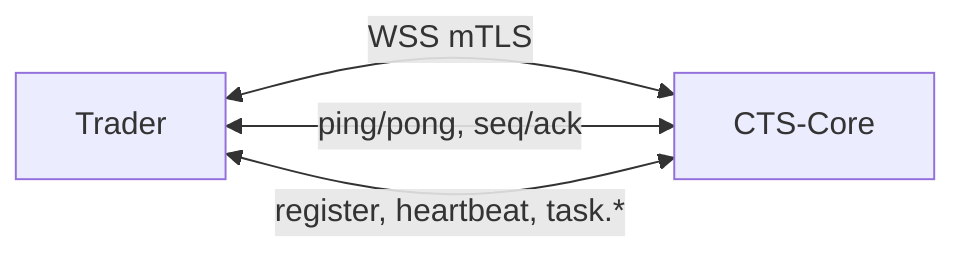
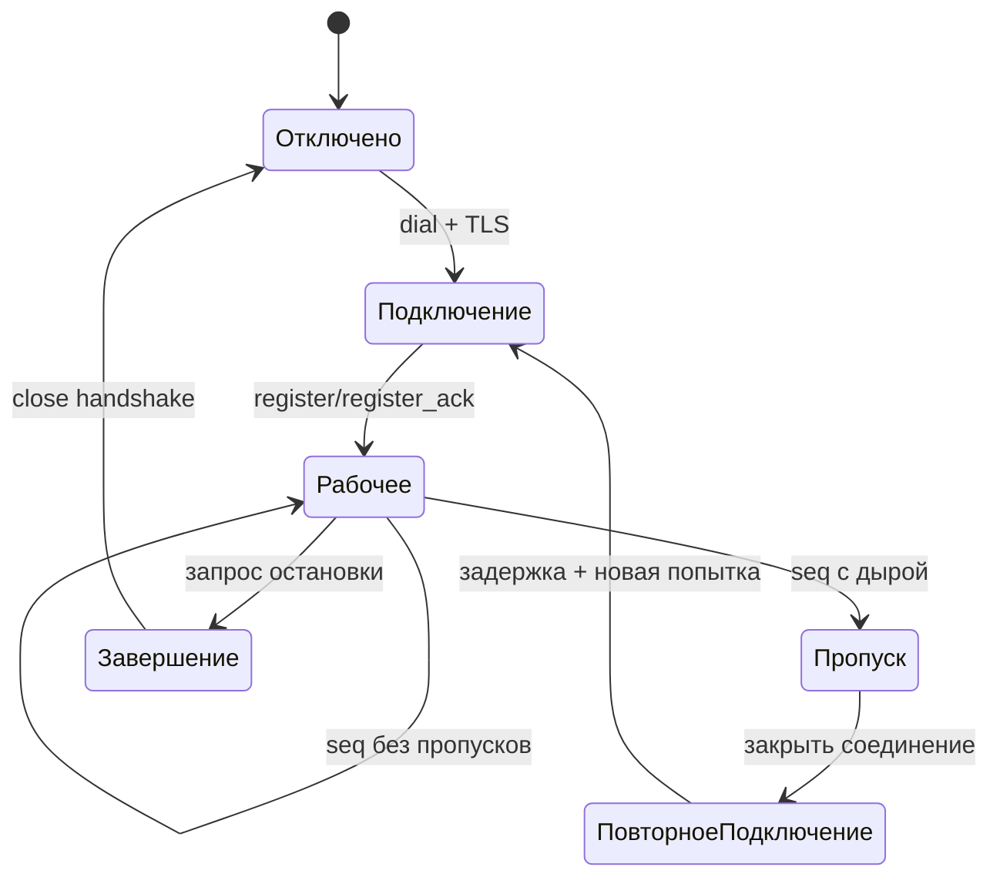

# Транспортный уровень WebSocket между CTS-Core и Trader

Дата: 2026-04-01
Статус: утвержденный транспортный контур

## 1. Назначение

Этот документ описывает только транспортный слой связи между CTS-Core и Trader:

- защищенное соединение по сертификатам;
- удержание канала через ping/pong;
- обнаружение зависших и оборванных соединений;
- восстановление после обрыва;
- упорядочивание сообщений через seq/ack.

Бизнес-гарантии финансовых событий реализуются отдельным слоем поверх этого транспорта.

## 2. Область ответственности транспорта

Транспортный уровень включает:

- TLS с обязательным клиентским сертификатом;
- проверку сертификата и отклонение неверных подключений;
- ping/pong, таймауты чтения и записи;
- корректный close и очистку состояния;
- повторное подключение Trader с мягким увеличением задержки;
- seq/ack для контроля порядка и обнаружения пропусков.

Транспортный уровень не решает:

- надежную доставку финансовых событий через долговечный буфер;
- повторную отправку по диапазонам;
- бизнес-подтверждения уровня сделок и проводок.

## 3. Общая схема



## 4. Сертификаты и защита канала

## 4.1 Обязательные требования

- канал только по TLS;
- клиентский сертификат обязателен;
- соединения без сертификата отклоняются;
- сертификат проверяется по центру сертификации и правилам соответствия сервису.

## 4.2 Что проверяет CTS-Core

- цепочку доверия сертификата клиента;
- допустимость сертификата по сроку;
- соответствие сертификата нужному сервису Trader по правилам SAN/CN/OU;
- при несоответствии подключение не допускается до перехода в рабочий обмен сообщениями.

## 4.3 Правила identity (trader channel)

- `trader_id` выводится только из CN клиентского сертификата.
- `payload.trader_id` не участвует в идентификации.
- в trader channel допускаются только клиентские сертификаты с `OU=Trading`.
- CN должен быть уникальным в системе (`TRADER.CERTIFICATE_CN`).
- при перевыпуске сертификата CN должен оставаться прежним; иначе это отдельная миграция identity.

## 5. Удержание соединения и таймауты

## 5.1 Ping/Pong

- сторона, удерживающая канал, периодически отправляет ping;
- в ответ должна прийти pong;
- при отсутствии pong в пределах таймаута соединение закрывается;
- после закрытия Trader выполняет повторное подключение.
- `cts-core` закрывает соединение при отсутствии входящей активности от `trader` в пределах таймаута чтения (входящее сообщение, ping или pong).

## 5.2 Таймауты

- таймаут чтения ограничивает время ожидания входящих кадров;
- таймаут записи ограничивает отправку исходящих кадров;
- при превышении таймаута соединение закрывается как неисправное.

Рекомендуемые стартовые значения:

- интервал heartbeat (и контрольной активности канала): 60 секунд;
- таймаут входящей активности на стороне `cts-core`: 180 секунд;
- таймаут записи: 5 секунд.

## 6. Порядок сообщений через seq/ack

## 6.1 Поля

Каждое сообщение содержит:

- seq: номер текущего исходящего сообщения отправителя;
- ack: номер последнего непрерывно полученного сообщения от второй стороны.

Правило чтения сообщения:

- seq отвечает на вопрос "какое это мое сообщение по счету";
- ack отвечает на вопрос "до какого твоего сообщения я получил все без дыр".

## 6.2 Минимальные правила обработки

- если входящий seq равен last_in_seq + 1, сообщение принимается;
- если входящий seq меньше или равен last_in_seq, это дубль и повторно не применяется;
- если входящий seq больше last_in_seq + 1, обнаружен пропуск.

При пропуске применяется сценарий восстановления канала:

- фиксируем событие в журнале;
- закрываем соединение;
- выполняем повторное подключение;
- догоняем состояние через синхронизацию.

## 6.3 Диаграмма состояний



## 7. Повторное подключение Trader

Требования:

- попытки идут автоматически;
- задержка между попытками увеличивается мягко;
- рост задержки ограничен верхним пределом;
- при стабильном соединении задержка сбрасывается к начальному значению.

Рекомендуемая политика:

- 1 секунда -> 2 -> 3 -> ... -> 10 секунд максимум;
- добавлять случайное отклонение 10-20 процентов, чтобы несколько экземпляров не подключались одновременно.

## 8. Корректное завершение

При штатной остановке:

- отправляется close-кадр;
- ожидается ответ второй стороны в разумный срок;
- после этого соединение закрывается локально;
- все служебные горутины и структуры состояния освобождаются.

Для аварийного случая:

- при отсутствии входящих кадров от `trader` дольше таймаута чтения `cts-core` принудительно завершает соединение и очищает состояние сессии.

## 9. Формат сообщений

## 9.1 Общий каркас

```json
{
  "type": "request|event|response",
  "action": "...",
  "request_id": "...",
  "session_id": "...",
  "seq": 123,
  "ack": 120,
  "ts": 1760000000000,
  "payload": {}
}
```

## 9.2 Пример register

```json
{
  "type": "request",
  "action": "trader.register",
  "request_id": "reg-001",
  "session_id": "tmp-unset",
  "protocol_version": "1",
  "seq": 1,
  "ack": 0,
  "ts": 1760000000000,
  "payload": {
    "release": "v0.0.1",
    "region": "eu"
  }
}
```

## 9.3 Пример register_ack

```json
{
  "type": "response",
  "action": "trader.register_ack",
  "request_id": "reg-001",
  "session_id": "sess-7f9a1",
  "seq": 1,
  "ack": 1,
  "ts": 1760000000100,
  "payload": {
    "status": "ok",
    "trader_id": "trader-eu-1",
    "session_timeout_sec": 180
  }
}
```

## 9.4 Пример heartbeat

```json
{
  "type": "event",
  "action": "trader.heartbeat",
  "request_id": "hb-0002",
  "session_id": "sess-7f9a1",
  "seq": 2,
  "ack": 1,
  "ts": 1760000005000,
  "payload": {
    "status": "active"
  }
}
```

## 10. Связанные параметры конфигурации

## 10.1 Trader

Используется раздел core_connections.ws:

```yaml
core_connections:
  ws:
    enabled: true
    url: "wss://cts-core:8080/ws"
    reconnect_delay_sec: 5
    heartbeat_interval_sec: 60
    protocol_version: "1"
    region: "eu"
    tls:
      ca_path: "/etc/ssl/cts/ca.crt"
      cert_path: "/etc/ssl/cts/trader.crt"
      key_path: "/etc/ssl/cts/trader.key"
      server_name: "cts-core"
```

Примечание по актуальному контракту trader-конфига:
- поле `core_connections.ws.trader_id` удалено;
- `core_connections.ws.tls.enabled` и `core_connections.ws.tls.min_version` удалены;
- поле `release` не задается в YAML: оно формируется из build metadata и отправляется в `trader.register`;
- минимальная версия TLS и требование mTLS enforced в коде клиента.

## 10.2 CTS-Core

Используются параметры сессии и ограничения входящего канала:

```yaml
session:
  heartbeat_interval: 60s
  heartbeat_timeout: 180s
  max_payload_bytes: 65536
  request_dedup_window: 1m

rate_limit:
  websocket:
    messages_per_second: 50
    burst: 100
```

Параметры TLS listener и проверки клиентских сертификатов должны быть заданы отдельно в конфигурации запуска сервера.

## 11. Отдельный слой финансовой надежности

Для финансовых событий используется отдельный бизнес-слой надежности:

- долговечный исходящий буфер на стороне Trader;
- идемпотентная запись на стороне CTS-Core;
- подтверждение только после фиксации в хранилище;
- повторная отправка неподтвержденных финансовых событий после переподключения.

## 12. Свойства транспортного слоя

- подключение возможно только с корректным клиентским сертификатом;
- обрыв и half-open выявляются не позже таймаута pong;
- Trader восстанавливает соединение автоматически;
- остановка сервисов не оставляет висящих соединений и горутин;
- поля seq/ack присутствуют во всех рабочих сообщениях и проверяются при приеме.
